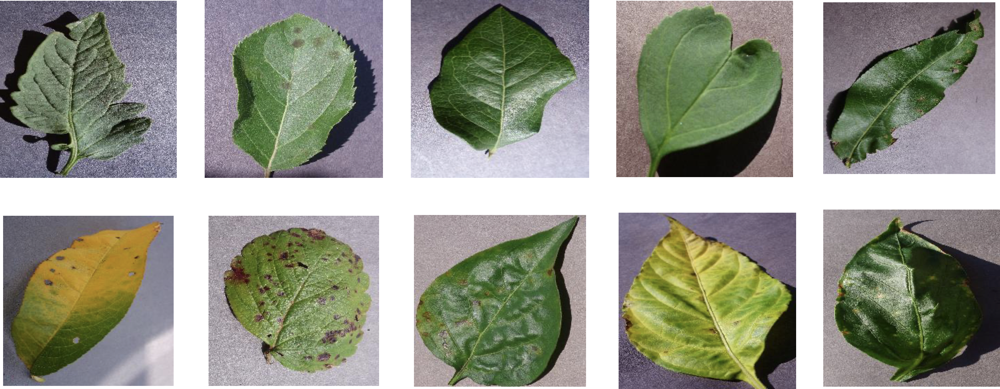

# Actividad 3: Construcción de un modelo para clasificación de hojas y su estado de salud
## Contexto del problema
Las enfermedades presentes en los cultivos son una gran amenaza para la seguridad alimentaria, pero su rápida identificación sigue siendo difícil en muchas partes del mundo debido a la falta de infraestructura. El gran incremento en el uso de teléfonos inteligentes a nivel mundial y los avances recientes en visión computacional gracias al aprendizaje profundo han allanado el camino para el diagnóstico de enfermedades asistido por teléfonos inteligentes. En general, el enfoque basado el uso de aprendizaje profundo en conjuntos de datos de imágenes cada vez más grandes y disponibles públicamente representa un camino claro hacia el diagnóstico de enfermedades de cultivos asistido por teléfonos inteligentes a una escala global masiva.

## Objetivo
Tu objetivo en esta actividad será desarrollar un modelo basado en redes neuronales convolucionales  para la identificación de plantas y su estado de salud a partir de imágenes de sus hojas.  Para entrenar y validar el modelo, tienes a tu disposición un conjunto de datos públicos de 54,306 imágenes de hojas de plantas enfermas y sanas recolectadas en condiciones controladas. En el conjunto de datos identificarás 14 especies de cultivos y 26 enfermedades (o ausencia de las mismas).  En la figura 1, puedes observar una muestra de las imágenes.

Durante el desarrollo de su actividad deberá tomar decisiones respecto a:

a) Topología de la red neuronal convolucional,

b) Elección del tipo de imágenes. Por ejemplo:

- Imágenes a color
- Imágenes en escala de grises
- Imágenes segmentadas.

Descargue el conjunto de datos de su elección: [color.zip](https://iteso01-my.sharepoint.com/:u:/g/personal/fcervantes_iteso_mx/EQus5dcaXSRNkr0Z2O2KLJkBSgDmmE9-DCJONSHT8gKM0Q?e=8UzwPQ), [grayscale.zip](https://iteso01-my.sharepoint.com/:u:/g/personal/fcervantes_iteso_mx/ET1n6jirfSpJsXcnwwc6LJ0BIkzJpcTXvjOGBA66x52KRg?e=Us8pR6), [segmented.zip](https://iteso01-my.sharepoint.com/:u:/g/personal/fcervantes_iteso_mx/Ed0LCLmQIp9AmTXf7q7lFyYB8blPdxVnJAl630tV6tJG5w?e=t1kMCe)

c) Elección del tamaño de  los conjuntos de datos. Por ejemplo:

- Entrenamiento: 80%
- Validación: 20%
- Pruebas: 2%

d) Para el entrenamiento de su modelo, deberá elegir las funciones de costo, algoritmos de optimización, número de épocas y parámetros apropiados acorde al problema, los datos que tiene disponible, la capacidad de la infraestructura a la que tiene acceso, la arquitectura de la red convolucional y el tiempo que tiene disponible para entregar los resultados de su actividad.

Nota: para esta actividad no es válido utilizar modelos preentrenados u otros conjuntos de datos provistos por Tensorflow.

### Descripción del dataset

Al acceder al conjunto de datos encontrará la siguiente organización de archivos:

|------- color: Imágenes en formato RGB, 256x256

|------- grayscale: Imágenes en escala de grises, 256 x 256

|------- segmented: Imágenes segmentadas , 256 x 256

En cada carpeta, se encuentran organizadas las imágenes acorde a la clase a la que pertenecen y el estado de salud (esto se indica mediante el nombre de la carpeta).  Veamos los siguientes ejemplos:

| Nombre de la carpeta     | Tipo de hoja | Estado de salud |
| ------------------------ | ------------ | --------------- |
| apple___apple_scab       | apple        | not healthy     |
| apple___healthy          | apple        | healthy         |
| blueberry___healthy      | blueberry    | healthy         |
| Strawberry___Leaf_scorch | Strawberry   | not healthy     |

### Productos entregables

1) Código fuente

2) Los 5 mejores modelos entrenados acorde a la evaluación de desempeño que realizaste.
- Código fuente
- Reporte técnico que incluya
    - Datos de presentación
    - Descripción de modelo base
    - Descripción de estrategia utilizada para encontrar los 5 mejores modelos
    - Descripción de sus 5 mejores modelos (arquitectura, configuración, etc.)
    - Tabla comparativa de sus 5 mejores modelos
    - Conclusiones
