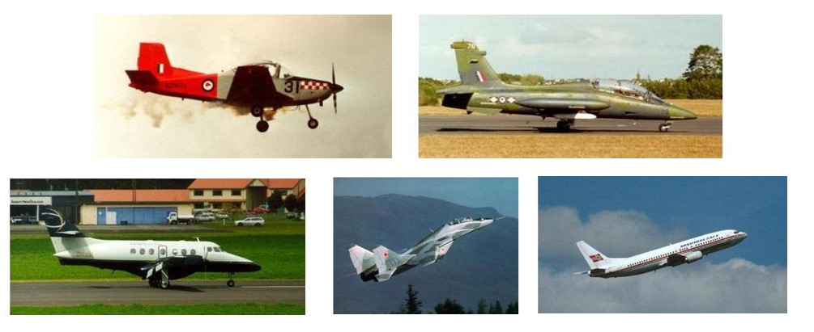
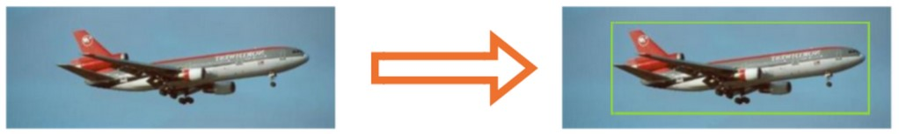

# Actividad 6. Construcción de un modelo para localizar aviones

## Descripción del problema

En esta actividad tu objetivo es construir un modelo que pueda localizar aviones dentro de una imagen. Para el entrenamiento, validación y prueba de tu modelo descarga el siguiente archivo que contiene imágenes de aviones.

Al descomprimir el archivo, encontrarás:
- Carpeta con imágenes.
- Un archivo CSV que contiene anotaciones de las imágenes.

A continuación puedes ver algunos ejemplos de las imágenes.

El archivo CSV contiene en cada renglón la anotación correspondiente a una imagen, utilizando el siguiente formato:

**[nombre_de_archivo.jpg] , [Xmin] , [Ymin], [Xmax], [Ymax]**

Por ejemplo:

**image_0778.jpg,53,26,353,113**

Una vez tengas tu modelo entrenado, validado y probado con un buen desempeño, el resultado esperado es el siguiente:

Dada una imagen nueva, tu modelo debe mostrar la localización del avión de la siguiente manera:

## Descripción de la actividad

Una vez descargados los datos, realiza las siguientes etapas de la actividad:

1) Implementa un generador para los conjuntos de datos de entrenamiento, validación y prueba. En caso de ser necesario, aplica el aumento de datos para generar más imágenes. (20 pts)

2) Antes de iniciar la implementación determina ¿cuál debería ser la forma de los datos de entrada y salida esperada para tu modelo? Para la arquitectura de tu modelo, se sugiere que elijas como base uno de los modelos preentrenados de tensorflow.keras.applications (10 pts)

3) En caso de ser necesario, agrega capas de entrada, capas ocultas y de salida para que tu modelo realiza de forma apropiada la tarea de localización. Para determinar la configuración de la capa de salida, recuerda cuál es la salida esperada para tu modelo. (10 pts)

4) Entrena y valida tu modelo.

- Utilizando como función de pérdida el error cuadrado medio y accuracy como métrica. (10 pts)
- Utilizando como métrica: IoU. (10 pts)
- Utilizando como función de pérdida y métrica: GIoU. (10 pts)

5) Evalúa tu mejor modelo utilizando las imágenes de tu conjunto de pruebas. (10 pts)

6) Descarga de Internet 10 imágenes de aviones y realiza las predicciones con tu modelo. ¿Qué tan bueno fue tu modelo? ¿porque? (10 pts)

## Productos esperados

Los productos esperados para la actividad es:

- Implementación en Python
- Mejor modelo
- Imágenes descargadas de Internet y resultados de las predicciones.
